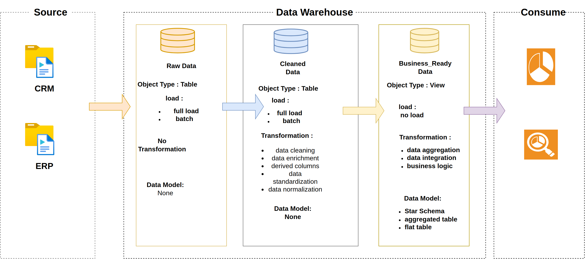
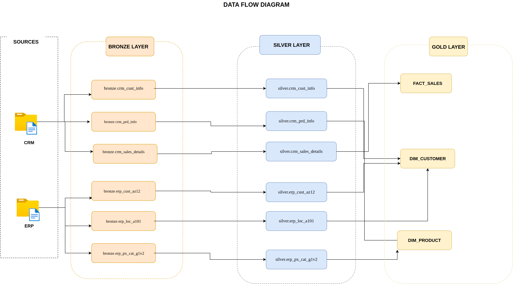
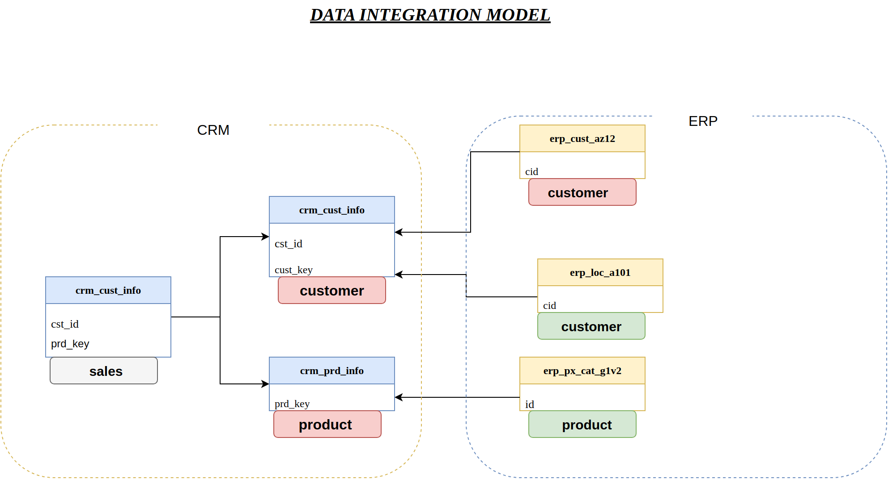

# SQL Data Warehouse Project

An end-to-end data warehouse built on **SQL Server (T-SQL)**, following the **Medallion Architecture** (Bronze → Silver → Gold). It ingests raw CRM and ERP exports, cleans and standardizes them, and publishes a business-ready **star schema** for analytics and BI.

> 📄 New here? Start with **[ABOUT.md](ABOUT.md)** for the project background, objectives and design decisions.

---

## 🏛️ Data Architecture

Data moves through three layers. Each layer has a clear contract: what it stores, how it is loaded, and what transformations are allowed.



| Layer | Object type | Load | Transformations | Data model |
|-------|-------------|------|-----------------|------------|
| 🥉 **Bronze** | Tables | Full load, batch (`TRUNCATE` + `BULK INSERT`) | None — raw as-is | None |
| 🥈 **Silver** | Tables | Full load, batch | Cleaning, standardization, derived columns, enrichment, normalization | None |
| 🥇 **Gold** | Views | No load (computed on read) | Aggregation, integration, business logic | Star schema |

---

## 🔄 Data Flow

Six source files land in Bronze, are refined one-to-one into Silver, and are then integrated into three Gold objects: two dimensions and one fact.



---

## 🔗 Data Integration Model

How the CRM and ERP entities join together — the keys that make cross-source integration possible.



---

## ⭐ Gold Layer — Star Schema

| Object | Type | Grain | Description |
|--------|------|-------|-------------|
| `gold.dim_customers` | View | One row per customer | CRM demographics enriched with ERP country and birthdate; surrogate key `customer_key` |
| `gold.dim_products` | View | One row per active product | CRM product master joined to ERP category/subcategory; historical versions filtered out |
| `gold.fact_sales` | View | One row per order line | Sales metrics linked to both dimensions via surrogate keys |

---

## 📁 Repository Structure

```
sql_datawarehouse_project/
│
├── README.md                       # Project intro (this file)
├── ABOUT.md                        # Background, objectives and design decisions
│
├── datasets/                       # Raw source files
│   ├── source_crm/
│   │   ├── cust_info.csv
│   │   ├── prd_info.csv
│   │   └── sales_details.csv
│   └── source_erp/
│       ├── CUST_AZ12.csv
│       ├── LOC_A101.csv
│       └── PX_CAT_G1V2.csv
│
├── scripts/
│   ├── init_database.sql           # Creates the DataWarehouse DB + bronze/silver/gold schemas
│   ├── bronze/
│   │   ├── ddl_bronze.sql          # Bronze table definitions
│   │   └── proc_load_bronze.sql    # bronze.load_bronze — BULK INSERT from CSV
│   ├── silver/
│   │   ├── ddl_silver.sql          # Silver table definitions
│   │   └── proc_load_silver.sql    # silver.load_silver — cleaning & standardization
│   └── gold/
│       └── ddl_gold.sql            # Gold star-schema views
│
├── tests/
│   ├── quality_checks_silver.sql   # Data quality checks on the Silver layer
│   └── quality_checks_gold.sql     # Integrity & uniqueness checks on the Gold layer
│
└── Docs/
    ├── images/                     # Rendered diagrams used in this README
    ├── Data Architecture Design.drawio
    ├── FLOW DATA.drawio
    ├── DATA INTEGRATION MODEL.drawio
    └── naming_conventions.md       # Naming standards for schemas, tables and columns
```

---

## 🚀 Getting Started

**Requirements:** SQL Server (2019+ or Express) and SQL Server Management Studio / Azure Data Studio.

1. **Clone the repository**

   ```bash
   git clone https://github.com/mahmoudemad2810/sql_datawarehouse_project.git
   ```

2. **Create the database and schemas**

   ```sql
   -- ⚠️ init_database.sql DROPS an existing 'DataWarehouse' database. Run on a non-production instance.
   :r scripts/init_database.sql
   ```

3. **Point the loader at your CSV files.** `scripts/bronze/proc_load_bronze.sql` uses absolute `BULK INSERT` paths — update them to where you cloned `datasets/`.

4. **Build and load the layers**

   ```sql
   -- Bronze
   :r scripts/bronze/ddl_bronze.sql
   EXEC bronze.load_bronze;

   -- Silver
   :r scripts/silver/ddl_silver.sql
   EXEC silver.load_silver;

   -- Gold
   :r scripts/gold/ddl_gold.sql
   ```

5. **Validate**

   ```sql
   :r tests/quality_checks_silver.sql
   :r tests/quality_checks_gold.sql
   ```

6. **Query the Gold layer**

   ```sql
   SELECT TOP 10 * FROM gold.fact_sales;
   ```

---

## 📚 Documentation

- **[ABOUT.md](ABOUT.md)** — project background, objectives, scope and design decisions
- **[Docs/naming_conventions.md](Docs/naming_conventions.md)** — naming standards for schemas, tables, columns and stored procedures
- **Docs/*.drawio** — editable diagram sources (open at [draw.io](https://app.diagrams.net))

---

## 👤 Author

Built by [@mahmoudemad2810](https://github.com/mahmoudemad2810) as a hands-on data engineering portfolio project.
